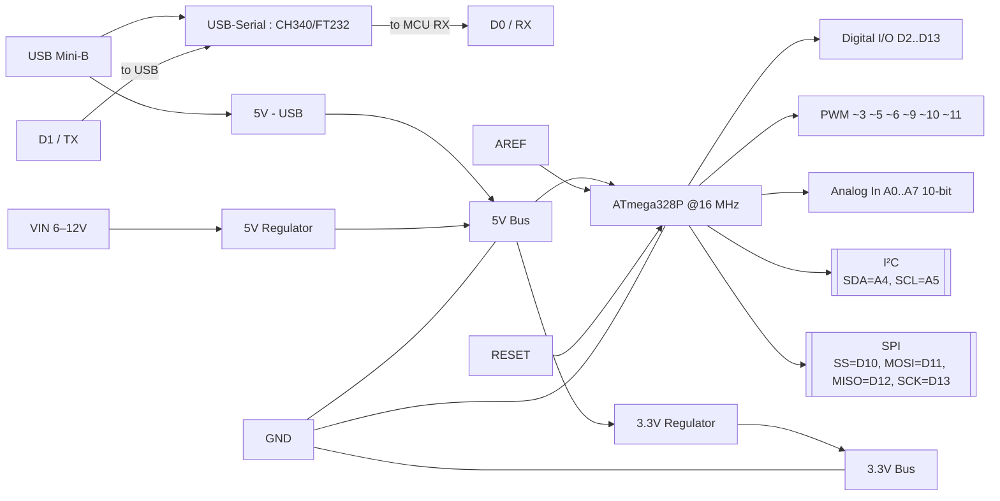

Since AI has arrived,  robotics begins from automation ( so far people called automation as robot). Thanks to CNN, computer vision gave eyes to robot. And the brain, thanks to LLM and AI.

Some effort to make an array in soldering,

